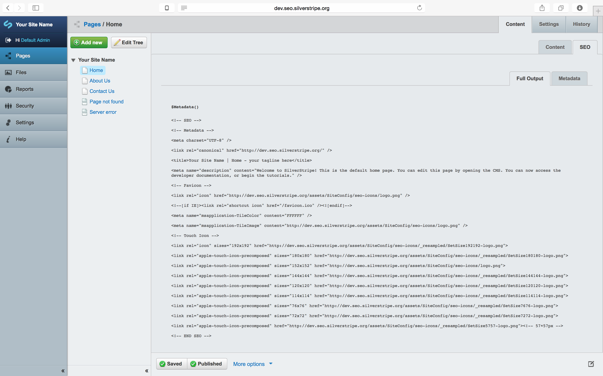
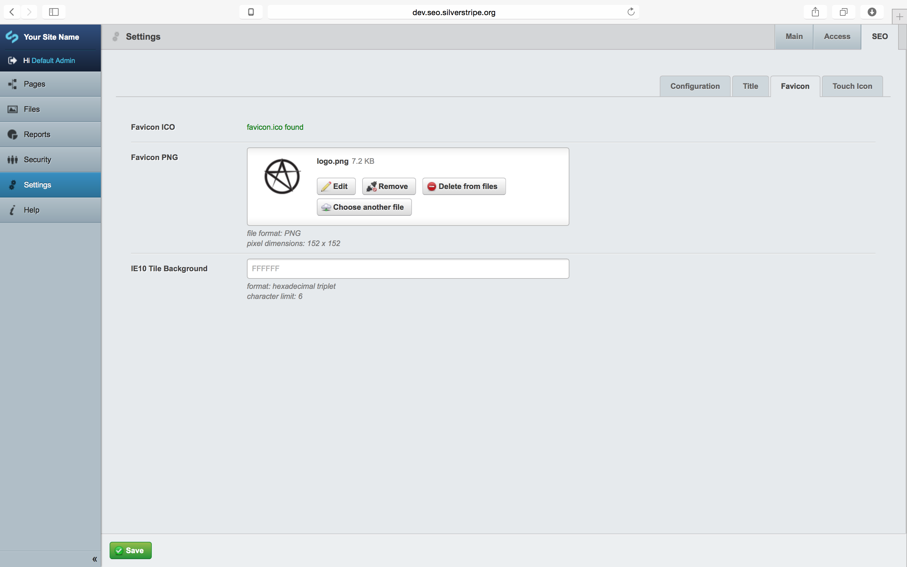
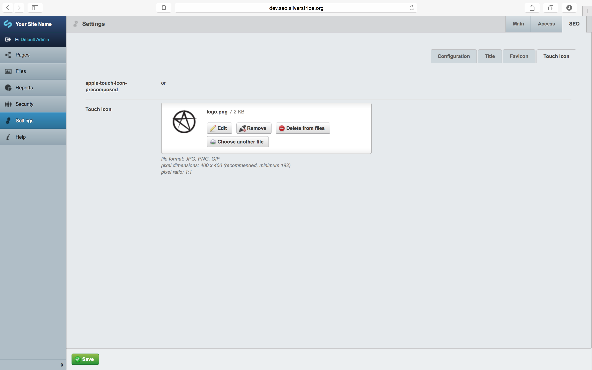

[](https://travis-ci.org/Graphiques-Digitale/silverstripe-seo-icons) [](https://scrutinizer-ci.com/g/Graphiques-Digitale/silverstripe-seo-icons/?branch=master)

## Overview ##

This is a modular extension for [graphiques-digitale/silverstripe-seo-metadata](https://github.com/Graphiques-Digitale/silverstripe-seo-metadata)

It enables enhanced **_favicon_** and **_pinned icon_** features.

Favicon inspired by: [audreyr/favicon-cheat-sheet](https://github.com/audreyr/favicon-cheat-sheet), [Jonathan T. Neal - Understand the Favicon](http://www.jonathantneal.com/blog/understand-the-favicon/) and [High Quality Visuals for Pinned Sites in Windows 8](http://blogs.msdn.com/b/ie/archive/2012/06/08/high-quality-visuals-for-pinned-sites-in-windows-8.aspx)

It requires:
* [`Graphiques-Digitale/silverstripe-seo-metadata`][2]

It is intended to be used alongside it's siblings:
* [`Graphiques-Digitale/silverstripe-seo-facebook-domain-insights`][4]
* [`Graphiques-Digitale/silverstripe-seo-open-graph`][5]

These are all optional and fragmented from the alpha version [`SSSEO`][1], which is now redundant.

The whole module collection is based largely on [18 Meta Tags Every Webpage Should Have in 2013][6].

Also, a good overview: [5 tips for SEO with Silverstripe 3][7].

Touch icons inspired by: [Everything you always wanted to know about touch icons](https://mathiasbynens.be/notes/touch-icons)

## Installation ##

#### Composer ####

* `composer require graphiques-digitale/silverstripe-seo-icons`
* rebuild using `/dev/build/?flush`

#### From ZIP ####

* Place the extracted folder `silverstripe-seo-icons-{version}` into `silverstripe-seo-icons` in the SilverStripe webroot
* rebuild using `/dev/build/?flush`

## CMS Usage ##

All icons are set globally via `/admin/settings/` under the Metadata tab.

It is recommended you simply have a `favicon.ico` file in the root of your website

## Template Usage ##

Depending on your configuration, the general idea is to replace all header content relating to metadata with `$Metadata()` just below the opening `<head>` tag and `<% base_tag %>` include, e.g.:

```html
<head>
	<% base_tag %>
	$Metadata()
	<!-- further includes ~ viewport, etc. -->
</head>
```

This will output something along the lines of:

```html
<head>
	<base href="http://dev.seo.silverstripe.org/"><!--[if lte IE 6]></base><![endif]-->
	
<!-- SEO -->
<!-- Metadata -->
<meta charset="UTF-8" />
<link rel="canonical" href="http://dev.seo.silverstripe.org/" />
<title>Your Site Name | Home - your tagline here</title>
<meta name="description" content="Welcome to SilverStripe! This is the default home page. You can edit this page by opening the CMS. You can now access the developer documentation, or begin the tutorials." />
<!-- Favicon -->
<link rel="icon" href="http://dev.seo.silverstripe.org/assets/SiteConfig/seo-icons/logo.png" />
<!--[if IE]><link rel="shortcut icon" href="/favicon.ico" /><![endif]-->
<meta name="msapplication-TileColor" content="FFFFFF" />
<meta name="msapplication-TileImage" content="http://dev.seo.silverstripe.org/assets/SiteConfig/seo-icons/logo.png" />
<!-- Touch Icon -->
<link rel="icon" sizes="192x192" href="http://dev.seo.silverstripe.org/assets/SiteConfig/seo-icons/_resampled/SetSize192192-logo.png">
<link rel="apple-touch-icon-precomposed" sizes="180x180" href="http://dev.seo.silverstripe.org/assets/SiteConfig/seo-icons/_resampled/SetSize180180-logo.png">
<link rel="apple-touch-icon-precomposed" sizes="152x152" href="http://dev.seo.silverstripe.org/assets/SiteConfig/seo-icons/logo.png">
<link rel="apple-touch-icon-precomposed" sizes="144x144" href="http://dev.seo.silverstripe.org/assets/SiteConfig/seo-icons/_resampled/SetSize144144-logo.png">
<link rel="apple-touch-icon-precomposed" sizes="120x120" href="http://dev.seo.silverstripe.org/assets/SiteConfig/seo-icons/_resampled/SetSize120120-logo.png">
<link rel="apple-touch-icon-precomposed" sizes="114x114" href="http://dev.seo.silverstripe.org/assets/SiteConfig/seo-icons/_resampled/SetSize114114-logo.png">
<link rel="apple-touch-icon-precomposed" sizes="76x76" href="http://dev.seo.silverstripe.org/assets/SiteConfig/seo-icons/_resampled/SetSize7676-logo.png">
<link rel="apple-touch-icon-precomposed" sizes="72x72" href="http://dev.seo.silverstripe.org/assets/SiteConfig/seo-icons/_resampled/SetSize7272-logo.png">
<link rel="apple-touch-icon-precomposed" href="http://dev.seo.silverstripe.org/assets/SiteConfig/seo-icons/_resampled/SetSize5757-logo.png"><!-- 57×57px -->
<!-- END SEO -->

	<!-- further includes ~ viewport, etc. -->
</head>
```

## Issue Tracker ##

Issues are tracked on GitHub @ [Issue Tracker](https://github.com/Graphiques-Digitale/silverstripe-seo-icons/issues)

## Development and Contribution ##

Please get in touch @ [`hello@graphiquesdigitale.net`](mailto:hello@graphiquesdigitale.net) if you have any extertise in any of these SEO module's areas and would like to help ~ they're a lot to maintain, they should be improved continually as HTML evolves and I'm sure they can generally be improved upon by field experts.

## License ##

BSD-3-Clause license

See @ [Why BSD?][8]









[1]: https://github.com/Graphiques-Digitale/SSSEO
[2]: https://github.com/Graphiques-Digitale/silverstripe-seo-metadata
[3]: https://github.com/Graphiques-Digitale/silverstripe-seo-icons
[4]: https://github.com/Graphiques-Digitale/silverstripe-seo-facebook-domain-insights
[5]: https://github.com/Graphiques-Digitale/silverstripe-seo-open-graph
[6]: https://www.iacquire.com/blog/18-meta-tags-every-webpage-should-have-in-2013
[7]: http://www.silverstripe.org/blog/5-tips-for-seo-with-silverstripe-3-/
[8]: https://www.silverstripe.org/blog/why-bsd/
